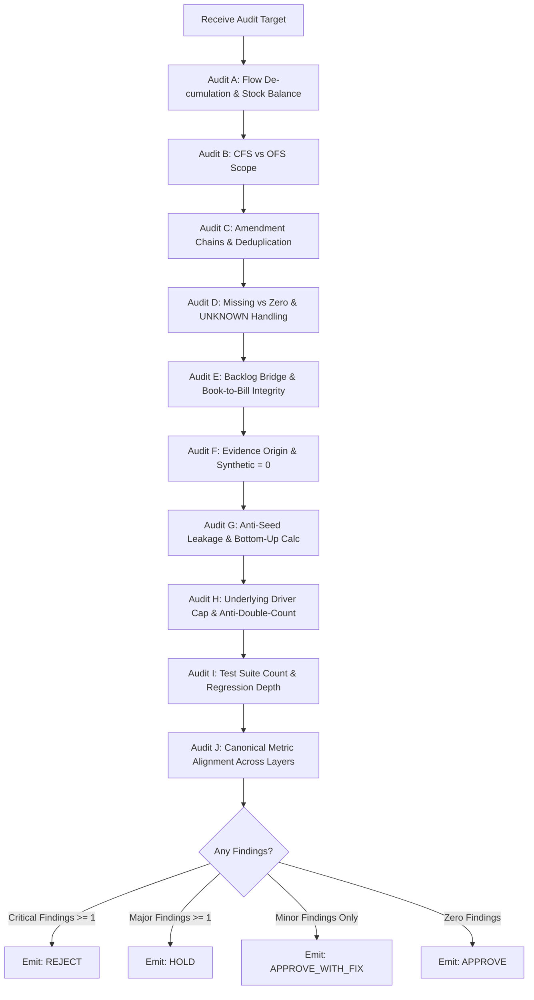

# Equity System Integrity Auditor

## 1. Skill Name
`equity-system-integrity-auditor`

## 2. Purpose
This skill provides an autonomous, adversarial audit protocol to verify the mathematical, accounting, and provenance integrity of equity research systems. It acts as an independent verifier that does not assume the correctness of downstream calculations or upstream data pipelines.

It rigorously detects and flags:
- Cumulative vs Discrete quarter miscalculations (Flow de-cumulation errors).
- Balance sheet stock account subtractions.
- Consolidated (CFS) vs Separate (OFS) entity scope contamination.
- Duplicate disclosure event counts across amendment chains (`[기재정정]`).
- Synthetic data or test fixture leakage into production runs.
- Backward target score fitting or hardcoded heuristic injection.
- Double counting of identical economic facts across multiple media/analyst sources.
- "Fake Zero" conversions of missing data (`UNKNOWN` $\to 0$).
- Canonical metric drift across multiple system layers.

---

## 3. When to Use
- Before approving any new Production Industry Radar run or production scoring release.
- When cross-validating financial metrics across multiple system layers (e.g. Fundamental vs Forward vs Industry Evidence).
- When ingesting new OpenDART regular quarterly reports or disclosure event series.
- During regression testing to ensure no test cases have been silently removed, disabled, or weakened.
- When an AI agent proposes architectural changes or new data transformations.

---

## 4. Required Inputs
1. **Target Artifact or Dataset to Audit**:
   - Financial statement series, disclosure event table, industry evidence payload, or scoring pipeline code.
2. **Raw Source Documentation / Payloads**:
   - Original OpenDART XML/JSON responses, DART filing reception numbers (`rcept_no`), public regulatory documents, or authenticated API payloads.
3. **Execution Run Metadata**:
   - `run_id`, `run_type` (`PRODUCTION` vs `TEST_FIXTURE`), `collector_name`, `raw_payload_hash`, `transformation_version`.

---

## 5. Optional Inputs
- Canonical Fact Registry definitions.
- Prior verified baseline audit reports for differential regression checks.

---

## 6. Immutable Audit Rules & Domain Checklists

```text
┌────────────────────────────────────────────────────────────────────────────────────────┐
│                        10-Domain System Integrity Audit Matrix                         │
├────────────────────────────────────────────────────────────────────────────────────────┤
│ Domain A: Financial Period Integrity (FLOW De-cumulation vs STOCK Point-in-Time)       │
│ Domain B: Entity Scope Integrity (Consolidated CFS Priority & Scope Separation)        │
│ Domain C: Disclosure Amendment Chain (Latest Version Deduplication & Linking)          │
│ Domain D: Missing Data Handling (UNKNOWN ≠ 0, UNKNOWN ≠ BAD, UNKNOWN ≠ GOOD)           │
│ Domain E: Backlog Bridge & Book-to-Bill (Discrete Matching Period & Scope Basis)       │
│ Domain F: Evidence Origin & Authenticity (LIVE_FETCHED / REFERENCE_VERIFIED Strict)    │
│ Domain G: Anti-Seed Leakage (Zero Backward Score Injection & Zero Synthetic in Prod)   │
│ Domain H: Anti-Double-Counting (Underlying Driver Cap & Evidence Family Grouping)      │
│ Domain I: Canonical Multi-Layer Consistency (Tolerance, Unit, Scope & Period Audit)   │
│ Domain J: Test Suite & Regression Coverage Integrity (No Test Deletion or Silencing)   │
└────────────────────────────────────────────────────────────────────────────────────────┘
```

### Detailed Domain Verification Standards

#### Domain A: Financial Period Integrity
- **FLOW Accounts (Income Statement & Cash Flow)**:
  - Korean quarterly filings report cumulative values ($Q_1, H_1, 9M, FY$). The auditor must verify that discrete single-quarter values are calculated via strict de-cumulation:
    $$\text{Discrete } Q_1 = Q_1 \text{ cumulative}$$
    $$\text{Discrete } Q_2 = H_1 \text{ cumulative} - Q_1 \text{ cumulative}$$
    $$\text{Discrete } Q_3 = 9M \text{ cumulative} - H_1 \text{ cumulative}$$
    $$\text{Discrete } Q_4 = FY \text{ cumulative} - 9M \text{ cumulative}$$
  - Applied strictly to: `Revenue`, `Operating Profit`, `Net Income`, `Operating Cash Flow`.
- **STOCK Accounts (Balance Sheet)**:
  - Balance sheet values represent point-in-time end-of-period stocks. Subtraction across quarters is **strictly prohibited**.
  - Applied strictly to: `Total Assets`, `Total Liabilities`, `Total Equity`, `Inventory`, `Accounts Receivable`, `Cash & Equivalents`, `Borrowings/Debt`.

#### Domain B: Entity Scope Integrity (CFS vs OFS)
- Consolidated Financial Statements (`CONSOLIDATED_CFS`) must always take precedence over Separate Financial Statements (`SEPARATE_OFS`).
- `SEPARATE_OFS` is allowed only as a fallback when CFS is legally non-existent.
- A single historical time series must never arbitrarily alternate between CFS and OFS without explicit scope annotation.

#### Domain C: Disclosure Amendment Chain Integrity
- When OpenDART issues an amendment filing (`[기재정정]`), it must be linked to the original economic event using `original_rcept_no` and `amendment_chain_id`.
- The system must only evaluate the latest active version (`is_latest_version = 1`). Prior superseded filings must **never** be counted as duplicate contracts or cumulative order expansions.

#### Domain D: Missing Data vs Zero Integrity
- A missing data point (`NULL` or `UNKNOWN`) must **never** be coerced into `0.0`.
- An unknown growth rate or missing backlog figure must be flagged as `UNKNOWN` with downgraded confidence, not evaluated as zero growth or negative distress.

#### Domain E: Backlog Bridge & Book-to-Bill Integrity
- Backlog bridge new order formula:
  $$\text{Estimated New Orders} = \text{Ending Backlog} - \text{Beginning Backlog} + \text{Recognized Revenue} + \text{Adjustments}$$
- If adjustment items (`cancellations_adj`, `fx_adj`, `scope_adj`) are `UNKNOWN`, the result must be explicitly tagged as `provisional_new_orders` and `UNADJUSTED_BRIDGE_ESTIMATE`.
- Book-to-Bill is valid **only** when numerator (New Orders) and denominator (Revenue) share the exact same discrete period and entity scope.

#### Domain F: Evidence Origin & Authenticity
- Every evidence item in a Production Run must possess an authenticated `origin_type`:
  - `LIVE_FETCHED`: Direct programmatic network/API download with recorded HTTP status and raw payload hash.
  - `REFERENCE_VERIFIED`: Paywalled or published institutional source with human/program verification and citation document ID.
  - `DERIVED_FROM_INTERNAL_DATA`: Computed deterministically from internal verified databases.
  - `MANUAL_QUALITATIVE`: Qualitative analyst input (strictly capped at $\le 35\%$ of total factor weight).
  - `SYNTHETIC` & `TEST_FIXTURE`: **Strictly prohibited in Production Runs (Count must be 0)**.

#### Domain G: Anti-Seed Leakage & Backward Fitting
- Production scores must be computed strictly **bottom-up**:
  $$\text{Evidence} \longrightarrow \text{Driver Normalization} \longrightarrow \text{Driver Cap} \longrightarrow \text{Factor Score} \longrightarrow \text{Total Score} \longrightarrow \text{Gate}$$
- Hardcoding a total score, passing desired target scores into production code, or fitting weights backward from a target result is a **Critical Fatal Violation**.

#### Domain H: Anti-Double-Counting
- Multiple news articles or analyst reports reporting the exact same economic contract or policy announcement must share a common `underlying_driver_id`.
- An individual underlying driver must be capped at its defined driver contribution cap (e.g. 10.0 pts) regardless of the number of duplicate supporting citations.

#### Domain I: Canonical Consistency Across Layers
- When the same metric (e.g. 2026 Q2 OPM) appears across Fundamental, Forward, and Industry layers:
  - Verify that values match within defined tolerance ($\pm 0.05\%p$ for OPM, $\pm 0.1\%p$ for growth rates).
  - If a difference exists, investigate whether it is caused by a scope differentiation (e.g. Consolidated vs Segment) or a true calculation mismatch.

#### Domain J: Test Suite & Regression Audit
- The auditor must verify that 100% of the regression test suite executes and passes.
- Any drop in the total number of executed tests, deletion of assertion checks, or commenting out of test cases is classified as a **Critical Blocking Finding**.

---

## 7. Audit Workflow & Decision Protocol



---

## 8. Forbidden Behaviors
- **DO NOT** issue an `APPROVE` verdict if `synthetic_evidence_count > 0` or `test_fixture_count > 0` in any production table.
- **DO NOT** accept cumulative $H_1$ revenue as discrete $Q_2$ revenue without de-cumulation.
- **DO NOT** allow separate OFS data to silently override consolidated CFS data without flagging.
- **DO NOT** assume downstream modules are correct without inspecting underlying raw SQL queries and data structures.

---

## 9. Output Contract
Every audit invocation must return a structured Audit Verdict report:

```markdown
# System Integrity Audit Report

## 1. Audit Summary
- **Audit Target**: [Pipeline / Dataset / Code / Release Component]
- **Audited As Of**: YYYY-MM-DD HH:MM:SS KST
- **Overall Verdict**: [APPROVE | APPROVE_WITH_FIX | HOLD | REJECT]

## 2. Findings by Severity

### Critical (Blockers - Immediate Failure)
- [CRIT-01] Description, file/query reference, violation of invariant rule.

### Major (Requires Immediate Resolution before Deployment)
- [MAJ-01] Description, affected metrics, impact on confidence scoring.

### Minor (Formatting, Precision, or Documentation Enhancements)
- [MIN-01] Description and suggested correction.

### Observations & Positive Validations
- [OBS-01] Verified Flow de-cumulation math for 8 quarters (100% matched).
- [OBS-02] Production Evidence Provenance contains 0 synthetic fixtures.

## 3. Detailed Audit Matrix by Domain
| Domain | Status | Checked Elements | Notes |
|---|---|---|---|
| A. Financial Period Integrity | PASSED / FAILED | Flow de-cumulation, Stock balances | |
| B. Entity Scope (CFS/OFS) | PASSED / FAILED | Consolidated hierarchy | |
| C. Amendment Chains | PASSED / FAILED | Latest version filtering | |
| D. Missing Data vs Zero | PASSED / FAILED | Null/Unknown preservation | |
| E. Backlog Bridge & B2B | PASSED / FAILED | Scope & period matching | |
| F. Evidence Authenticity | PASSED / FAILED | Origin distribution, 0 Synthetic | |
| G. Anti-Seed Leakage | PASSED / FAILED | Bottom-up recalculation | |
| H. Anti-Double-Counting | PASSED / FAILED | Driver cap enforcement | |
| I. Canonical Consistency | PASSED / FAILED | Cross-layer metric alignment | |
| J. Test Suite & Regression | PASSED / FAILED | Test count preservation | |

## 4. Required Remediation & Next Actions
1. Actionable step 1 for developer / system.
2. Actionable step 2.
```

---

## 10. Validation Checklist for Auditors
- [ ] Were raw quarterly filings verified to ensure $Q_2 = H_1 - Q_1$?
- [ ] Were balance sheet accounts confirmed as point-in-time balances without subtraction?
- [ ] Was the disclosure table checked for duplicate counts on `[기재정정]` filings?
- [ ] Was the production evidence table verified to have `SYNTHETIC = 0` and `TEST_FIXTURE = 0`?
- [ ] Was bottom-up score calculation verified without hardcoded score injection?
- [ ] Were canonical metrics checked across layers for matching scope and definition?
- [ ] Was the regression test suite executed with zero deleted or silenced tests?

---

## 11. Failure / Unknown Handling
- **Missing Raw Filings for Audit**: If raw source filings are inaccessible, mark Domain as `UNVERIFIED_DATA`, downgrade verdict to `HOLD`, and block production promotion until source verification is restored.
- **Unresolved Canonical Mismatch**: If cross-layer metrics differ beyond tolerance without documented scope justification, fail-closed by issuing `HOLD` until the canonical source is reconciled.

---

## 12. Example Usage

```text
[Audit Invocation]
- Target: PROD_2026_W33_001 Industry Evidence & 8Q Financial Table
- Scope: Verification of 9 Sectors and 6 Core Stocks

[Audit Execution Trace]
- Checking Domain A: Flow de-cumulation for 6 stocks across 8 quarters -> 48 discrete quarters verified (100% correct).
- Checking Domain C: 16 disclosure events checked; 2 amended contracts properly resolved to latest version (0 duplicates).
- Checking Domain F: 42 production evidence records inspected -> 31 LIVE_FETCHED, 7 REFERENCE_VERIFIED, 4 DERIVED_INTERNAL, 0 SYNTHETIC (100% compliant).
- Checking Domain G: Replay recalculation executed -> Evidence sum -> Driver cap -> Factor score matched exactly.
- Checking Domain I: Canonical check -> OPM (25.14% vs 25.10%) verified within 0.05%p tolerance. Backlog YoY scope differentiation verified.

[Final Verdict]
- Overall Verdict: APPROVE
- Critical Findings: 0
- Major Findings: 0
- Minor Findings: 0
```

---

## 13. Version & Inter-Skill Relationships
- **Methodology Version**: `1.0`
- **Compatible System**: `v1.0.0-shadow-prod`
- **Status**: `FROZEN_METHOD_V1`
- **Referenced Skills**:
  - `korean-equity-decision-system`: Independently audited by this skill across all 5 decision layers.
  - `atr-v4-trade-management`: Audited for monotonic stop ratchets, risk budgets, and $P_0/A_0$ anchor locking.
  - `shadow-performance-validator`: Audited for look-ahead bias, fixed ATR references, and minimum sample rules ($N \ge 30$).
