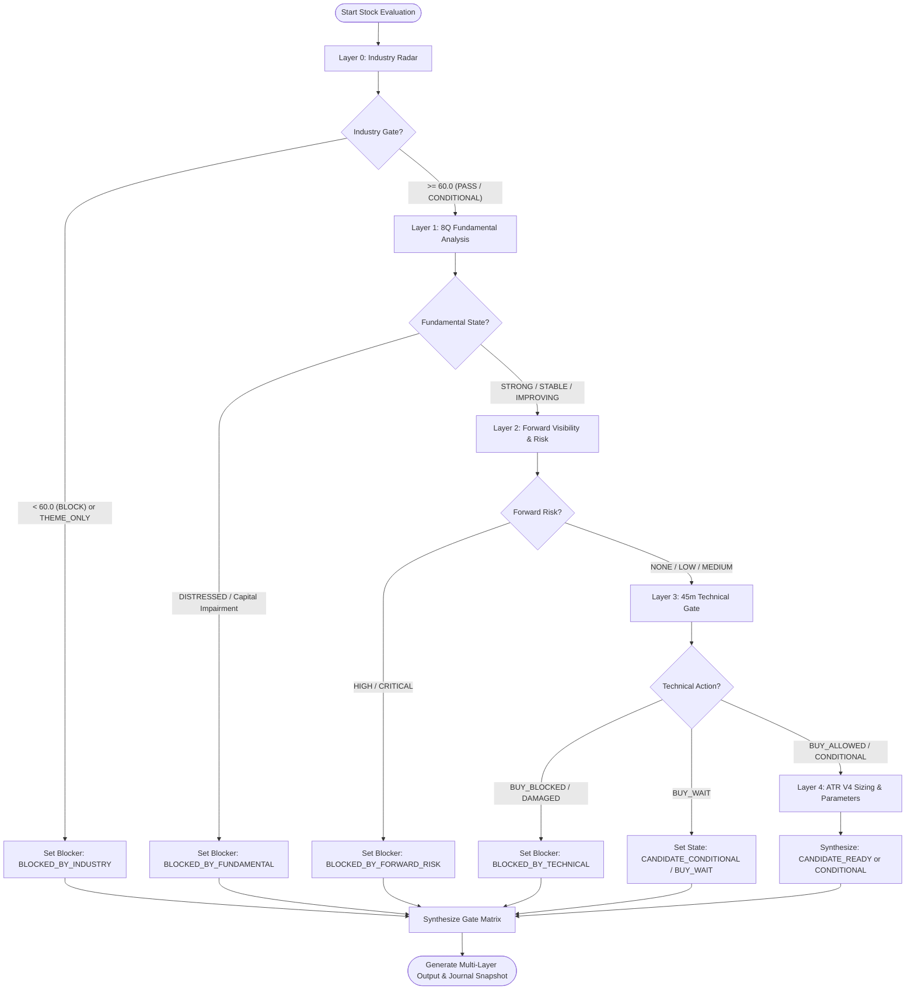

# Korean Equity Decision System

## 1. Skill Name
`korean-equity-decision-system`

## 2. Purpose
This skill governs the end-to-end evaluation and decision funnel for Korean equity securities. It establishes a multi-layered, non-collapsing gating architecture that evaluates macroeconomic industry tailwinds, multi-quarter fundamental health, forward-looking disclosure visibility, intraday technical momentum, and ATR-based volatility risk.

The core design principle is **separation of concerns**: a high-quality business is distinguished from a favorable tactical entry point, and independent risk blockers are never masked or smoothed over by high aggregate scores.

```text
┌────────────────────────────────────────────────────────────────────────────────────────┐
│                        Korean Equity Decision Funnel Architecture                      │
├────────────────────────────────────────────────────────────────────────────────────────┤
│ Layer 0: Weekly Industry Radar (Policy, Catalysts, Capex, Value Headwind, Risk)        │
│          └── Gate: INDUSTRY_PASS_STRONG / PASS / CONDITIONAL / WAIT / BLOCK            │
├────────────────────────────────────────────────────────────────────────────────────────┤
│ Layer 1: 8-Quarter Fundamental Evidence (CFS Flow/Stock De-cumulation, OPM, FCF, ROE)  │
│          └── State: STRONG / IMPROVING / STABLE / WEAKENING / DISTRESSED / UNKNOWN     │
├────────────────────────────────────────────────────────────────────────────────────────┤
│ Layer 2: Forward Visibility Layer (DART Order Book, Capa, Dilution, Book-to-Bill)      │
│          ├── Opportunity: VERY_STRONG / STRONG / MODERATE / WEAK / UNKNOWN             │
│          └── Risk: NONE / LOW / MEDIUM / REVIEW_REQUIRED / HIGH / CRITICAL             │
├────────────────────────────────────────────────────────────────────────────────────────┤
│ Layer 3: Technical Context & 45m Gate (Trend, Volume Flow, Momentum, Breakout/Cloud)   │
│          ├── State: STRONG / NEUTRAL / WEAK / DAMAGED / UNKNOWN                        │
│          └── Action: BUY_ALLOWED / BUY_ALLOWED_CONDITIONAL / BUY_WAIT / BUY_BLOCKED    │
├────────────────────────────────────────────────────────────────────────────────────────┤
│ Layer 4: ATR V4 Trade & Risk Engine (P0/A0/S0, Position Sizing, 3-Phase Scale-in)       │
│          └── Execution: Ref Price, Initial Stop (S0), Target (+3.0 A0), Trailing Floor │
├────────────────────────────────────────────────────────────────────────────────────────┤
│ Layer 5: User Final Approval (Explicit User Execution Consent Gate)                    │
│          └── Decision: BUY ON / BUY OFF / HOLD / REDUCE / LIQUIDATE                    │
└────────────────────────────────────────────────────────────────────────────────────────┘
```

---

## 3. When to Use
- When performing a comprehensive initial scan or diagnostic on Korean stocks listed on KRX (KOSPI, KOSDAQ).
- When evaluating whether an attractive macro theme or industry trend translates into an actionable individual stock candidate.
- When cross-validating corporate fundamental improvements against forward order backlog and technical timing.
- When generating structured, multi-layer Gate Matrix reports for automated analysis or human portfolio managers.

---

## 4. Required Inputs
1. **Target Stock Identity**:
   - `stock_code`: 6-digit KRX standard stock code (e.g. string padded with leading zeros).
   - `stock_name`: Official Korean corporate entity name.
2. **Industry Radar Context**:
   - `industry_id`: Primary sector or theme classification.
   - `industry_score`: Normalized industry score (0.0 to 100.0).
   - `industry_confidence`: High / Medium / Low evidence confidence.
   - `exposure_type`: `DIRECT_CORE`, `DIRECT_PARTIAL`, `INDIRECT`, `THEME_ONLY`, or `UNKNOWN`.
3. **8-Quarter Financial Dataset**:
   - Minimum 8 consecutive quarters of discrete financial statements (Revenue, Operating Profit, Net Income, Operating Cash Flow, Total Assets, Total Liabilities, Total Equity, Cash, Debt).
4. **Disclosure & Forward Data**:
   - OpenDART major supply contracts, capacity expansion, capital increase/dilution, and quarterly order backlog.
5. **Technical Candle Series**:
   - Daily OHLCV series (minimum 60 completed trading days).
   - Intraday 45-minute completed OHLCV series (minimum 40 completed bars).

---

## 5. Optional Inputs
- `market_consensus_forward_pe`: 12-month forward P/E ratio from consensus data provider.
- `peer_group_statistics`: Sector median operating margin and valuation multiples.
- `intraday_tick_flow`: Large institutional or foreign net flow tracking data.

---

## 6. Immutable Rules
1. **No Automatic Buy Promotion by Industry Alone**:
   - An Industry Score $\ge 85$ (`INDUSTRY_PASS_STRONG`) does not automatically trigger or elevate an individual stock to `BUY_ALLOWED`.
2. **Technical Gate Superiority on Entry Timing**:
   - Regardless of industry strength or fundamental quality, if the Technical Action is `BUY_BLOCKED`, new position entry is strictly prohibited (`BUY OFF`).
3. **Forward Risk as Independent Blocker**:
   - Forward Risk rated `HIGH` or `CRITICAL` constitutes an independent blocker and cannot be smoothed over by high historical earnings or strong industry tailwinds.
4. **No Arbitrary Substitution of UNKNOWN**:
   - Missing data (`UNKNOWN`) must never be mapped arbitrarily to `0.0`, `GOOD`, or `BAD`. It must be preserved and propagated with reduced confidence.
5. **No Single Compressed Metric**:
   - The system must never collapse the multi-layer evaluation into a single scalar score that hides conflicting signals. Each layer must report its gate status independently in the Matrix.
6. **Separation of Business Quality and Entry Timing**:
   - An outstanding company with extended technical indicators is categorized as `HOLD` or `BUY_WAIT`, never forced into immediate entry.
7. **Normalcy of 'No Candidates'**:
   - When no universe stock satisfies all concurrent gates, returning an empty candidate list (`No Buy Candidate`) is an expected, fully valid outcome.
8. **Exclusion of THEME_ONLY Companies**:
   - Companies categorized with `exposure_type = THEME_ONLY` (lacking direct revenue or product linkage to the macro theme) are permanently excluded from candidate promotion.
9. **Dual Scope Integrity (CFS Priority)**:
   - Consolidated financial statements (`CONSOLIDATED_CFS`) must be used as primary. Separate financial statements (`SEPARATE_OFS`) are permitted only when CFS is legally non-existent.
10. **Final Human Approval Invariant**:
    - Autonomous analysis generates `Candidate Signal Snapshots`; live capital execution requires explicit user approval.

---

## 7. Decision Flow & Gate Matrix



### Layer Classification Definitions

#### A. Industry Gate Thresholds
| Industry Score | Category | Gate Status | Operational Action |
|---|---|---|---|
| **$\ge 85.0$** | `CORE_MOMENTUM` | `INDUSTRY_PASS_STRONG` | Unrestricted top-tier industry priority |
| **$80.0 \sim 84.9$** | `SELECTIVE_CORE` | `INDUSTRY_PASS` | Standard core industry priority |
| **$70.0 \sim 79.9$** | `EMERGING_TURNAROUND` | `INDUSTRY_CONDITIONAL` | Strict fundamental & technical confirmation required |
| **$60.0 \sim 69.9$** | `WATCH` | `INDUSTRY_WAIT` | Pre-candidate tracking only; new buy paused |
| **$< 60.0$** | `EXCLUDE` | `INDUSTRY_BLOCK` | Full exclusion from buy candidate consideration |

*Note: If `industry_confidence == LOW`, `INDUSTRY_PASS_STRONG` is capped at `INDUSTRY_CONDITIONAL`.*

#### B. 8-Quarter Fundamental States
- `STRONG`: Revenue and OPM expansion sustained $\ge 2$ quarters; positive OCF; debt ratio stable.
- `IMPROVING`: Clear turnaround trajectory confirmed ($\ge 2$ quarters of sequential growth from trough).
- `STABLE`: Consistent revenue and margin generation within historical normal band; low balance sheet risk.
- `WEAKENING`: Margins contracting for $\ge 2$ quarters or operating cash flow deteriorating.
- `DISTRESSED`: Operating losses sustained $\ge 3$ quarters, negative equity, or audit qualification flags.
- `UNKNOWN`: Insufficient historical discrete filings (< 4 quarters available).

#### C. Forward Visibility & Risk States
- **Opportunity**: `VERY_STRONG` (B2B > 1.2x with high confidence), `STRONG` (B2B 1.0~1.2x), `MODERATE` (Backlog stable), `WEAK` (Backlog declining), `UNKNOWN`.
- **Risk**: `NONE` (Zero adverse events), `LOW` (Minor contract adjustments), `MEDIUM` (Minor single-quarter delay), `REVIEW_REQUIRED` (Convertible bonds/dilution announced), `HIGH` (Material contract cancel > 10% rev), `CRITICAL` (Major litigation, large direct equity dilution > 15%, debt default).

#### D. Technical Gate Actions
- `BUY_ALLOWED`: Daily trend confirmed, completed 45m bar above cloud/VWAP, OBV & Chaikin positive.
- `BUY_ALLOWED_CONDITIONAL`: Daily trend positive, 45m consolidation near support with pending volume trigger.
- `BUY_WAIT`: Extended technical indicators; waiting for -1.5 ATR pullback or key resistance breakout.
- `BUY_BLOCKED`: Completed 45m bar broken below cloud, strong selling volume flow, or ADX downtrend.

---

## 8. Forbidden Behaviors
- **DO NOT** elevate a base `BUY OFF` state to `BUY ON` based on technical indicators if Industry or Fundamental layers are blocked.
- **DO NOT** trigger automatic panic selling solely due to minor intraday 45m weakness when daily trend and ATR stop levels remain intact.
- **DO NOT** discard multiple concurrent blockers (e.g. if a stock is blocked by both Industry and Technicals, both must be recorded in `all_blockers`).
- **DO NOT** use uncompleted in-progress 45m bars for tactical gate determination.

---

## 9. Output Contract
Every evaluation must produce a deterministic dictionary / DTO matching this structure:

```json
{
  "stock_code": "STRING (6 digits)",
  "stock_name": "STRING",
  "evaluated_at": "YYYY-MM-DD HH:MM:SS KST",
  "layers": {
    "industry": {
      "industry_id": "STRING",
      "industry_score": "FLOAT (0-100)",
      "industry_gate": "INDUSTRY_PASS_STRONG | INDUSTRY_PASS | INDUSTRY_CONDITIONAL | INDUSTRY_WAIT | INDUSTRY_BLOCK",
      "industry_confidence": "HIGH | MEDIUM | LOW",
      "exposure_type": "DIRECT_CORE | DIRECT_PARTIAL | INDIRECT | THEME_ONLY | UNKNOWN"
    },
    "fundamental": {
      "fundamental_state": "STRONG | IMPROVING | STABLE | WEAKENING | DISTRESSED | UNKNOWN",
      "turnaround_type": "A | B | C | NONE",
      "latest_opm": "FLOAT (%)",
      "ocf_positive": "BOOLEAN"
    },
    "forward": {
      "forward_opportunity": "VERY_STRONG | STRONG | MODERATE | WEAK | UNKNOWN",
      "forward_confidence": "HIGH | MEDIUM | LOW",
      "forward_risk": "NONE | LOW | MEDIUM | REVIEW_REQUIRED | HIGH | CRITICAL",
      "book_to_bill": "FLOAT | null",
      "book_to_bill_status": "VALID_REPORTED | VALID_ESTIMATED | PROVISIONAL | B2B_NOT_COMPARABLE | NOT_APPLICABLE"
    },
    "technical": {
      "technical_state": "STRONG | NEUTRAL | WEAK | DAMAGED | UNKNOWN",
      "technical_action": "BUY_ALLOWED | BUY_ALLOWED_CONDITIONAL | BUY_WAIT | BUY_BLOCKED",
      "completed_bar_timestamp": "YYYY-MM-DD HH:MM:SS"
    },
    "risk": {
      "atr_14": "FLOAT (KRW)",
      "natr": "FLOAT (%)",
      "candidate_ref_price": "FLOAT (KRW)",
      "candidate_stop_price": "FLOAT (KRW)",
      "candidate_target_price": "FLOAT (KRW)"
    }
  },
  "integrated_decision": {
    "shadow_integrated_state": "CANDIDATE_READY | CANDIDATE_CONDITIONAL | BLOCKED_BY_INDUSTRY | BLOCKED_BY_FUNDAMENTAL | BLOCKED_BY_FORWARD_RISK | BLOCKED_BY_TECHNICAL",
    "primary_blocker": "NONE | BLOCKED_BY_INDUSTRY | BLOCKED_BY_FUNDAMENTAL | BLOCKED_BY_FORWARD_RISK | BLOCKED_BY_TECHNICAL",
    "all_blockers": ["ARRAY OF BLOCKER STRINGS"],
    "final_approval": "BUY_ON | BUY_OFF | HOLD | REDUCE"
  }
}
```

---

## 10. Validation Checklist
- [ ] Has the Industry Score been calculated bottom-up without test seed injection?
- [ ] Are the 8 quarters of financial data discrete (Flow de-cumulated) and based on Consolidated CFS?
- [ ] Is the Book-to-Bill ratio calculated on matching periods and matching entity scopes?
- [ ] Are all completed 45-minute bars verified with no in-progress bar contamination?
- [ ] Is the primary blocker correctly identified and separated from minor secondary flags?
- [ ] If `shadow_integrated_state` is blocked, is `final_approval` strictly `BUY_OFF`?

---

## 11. Failure / Unknown Handling
- **Missing Fundamental Data**: Set `fundamental_state = UNKNOWN`, decrease overall confidence to `LOW`, require manual fundamental review.
- **Unverified Disclosure Source**: If source document cannot be replayed or verified, discount driver contribution by 50% and flag as `PROVISIONAL`.
- **API or Data Feed Outage**: Enter `DATA_HOLD` status; fail-closed by prohibiting new buy signal generation while preserving existing protective stop orders.

---

## 12. Example Usage

```text
[Input Evaluation Context]
- Stock: Generic Capital Goods Corp (Code: 000000)
- Industry: POWER_GRID (Score: 88.0, Gate: INDUSTRY_PASS_STRONG, Exposure: DIRECT_CORE)
- Fundamental: STRONG (OPM 24.5%, OCF Positive, 8Q Growth Confirmed)
- Forward: VERY_STRONG (Book-to-Bill: 1.35 [PROVISIONAL], Forward Risk: NONE)
- Technical: BUY_ALLOWED_CONDITIONAL (Completed 45m Bar: 2026-08-17 14:15, Consolidation at 20 EMA)
- Risk: Ref Price: 100,000 KRW, ATR14: 4,000 KRW, S0: 94,000 KRW, Target: 112,000 KRW

[Output Gate Synthesis]
- Primary Blocker: NONE
- All Blockers: []
- Shadow Integrated State: CANDIDATE_CONDITIONAL
- Recommended Action: 1st Scale-in (50% of budget) approved upon user confirmation.
```

---

## 13. Version & Inter-Skill Relationships
- **Methodology Version**: `1.0`
- **Compatible System**: `v1.0.0-shadow-prod`
- **Status**: `FROZEN_METHOD_V1`
- **Referenced Skills**:
  - `atr-v4-trade-management`: Invoked for position sizing, S0/Target calculation, and trailing stop management.
  - `shadow-performance-validator`: Receives decision outputs and journal snapshots for forward performance attribution.
  - `equity-system-integrity-auditor`: Independently audits inputs, calculations, and gate integrity across all layers.
