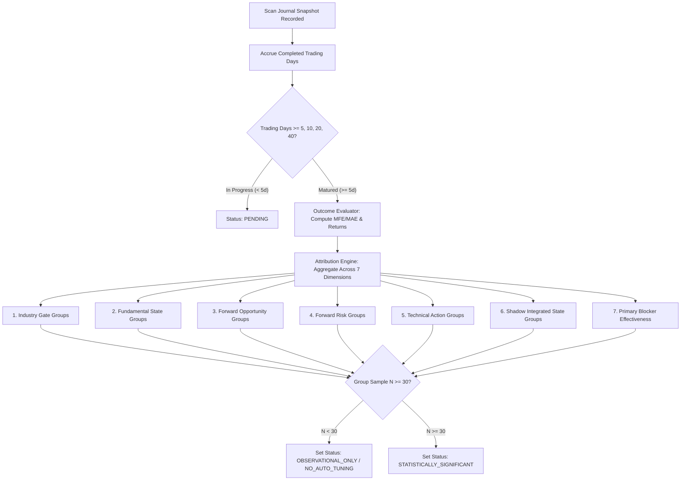

# Shadow Performance & Outcome Attribution Validator

## 1. Skill Name
`shadow-performance-validator`

## 2. Purpose
This skill establishes an immutable, forward-testing and attribution framework to measure the real-world market efficacy of multi-layer decision signals without risk of capital loss or statistical overfitting.

It enforces:
- **Append-Only Immutable Journaling**: Decision snapshots are recorded permanently at the exact moment of execution and can never be modified or overwritten retroactively.
- **Zero Look-Ahead Bias**: Forward outcomes are computed exclusively using subsequent trading calendar candles, anchored strictly to the entry price and ATR14 recorded in the snapshot.
- **MFE / MAE Volatility Tracking**: Maximum Favorable Excursion (MFE) and Maximum Adverse Excursion (MAE) are tracked in percentage terms and fixed-ATR multiples across 5, 10, 20, and 40 trading days.
- **Blocker Effectiveness Analysis**: Quantifies whether rejected candidates (`BLOCKED_BY_TECHNICAL`, `BLOCKED_BY_INDUSTRY`, `BLOCKED_BY_FORWARD_RISK`) prevented portfolio drawdown or prematurely filtered profitable winners.
- **Strict Anti-Auto-Tuning Governance**: Prevents premature parameter or threshold modifications on insufficient sample sizes ($N < 30$).

---

## 3. When to Use
- When tracking the forward market performance of shadow scan signals over 5d, 10d, 20d, and 40d holding periods.
- When evaluating the predictive validity and statistical edge of each decision gate (Industry, Fundamental, Forward, Technical).
- When assessing the opportunity cost vs loss protection of individual risk blockers.
- When reviewing system performance reports to ensure no model developer or AI agent modifies trading rules without reaching the minimum statistical sample threshold ($N \ge 30$, recommended $N \ge 50$).

---

## 4. Required Inputs
1. **Immutable Scan Journal Snapshot Record (`scan_journal`)**:
   - `journal_id`: Unique deterministic snapshot identifier (e.g. `JRN_YYYYMMDD_HHMMSS_CODE`).
   - `scan_timestamp`: Exact timestamp of scan execution (KST).
   - `trading_date`: KRX trading date of the snapshot.
   - `stock_code`: 6-digit KRX stock code.
   - `market_price`: Traded price at the exact moment of snapshot.
   - `atr14`: Completed 14-day Wilder ATR at the moment of snapshot (fixed anchor).
   - Multi-layer states: `industry_gate`, `fundamental_state`, `forward_opportunity`, `forward_risk`, `technical_action`, `shadow_integrated_state`, `primary_blocker`, `all_blockers`, `buy_approval`.
2. **Subsequent Market Candle Feed (`kiwoom_daily`)**:
   - Verified daily OHLCV candles occurring strictly after `scan_timestamp` on valid KRX trading days.

---

## 5. Optional Inputs
- `actual_trade_execution_records`: Matched live brokerage fills to compare `SHADOW_OUTCOME` against `ACTUAL_TRADE_OUTCOME`.
- `benchmark_index_daily_returns`: KOSPI / KOSDAQ daily returns for market-relative alpha attribution.

---

## 6. Immutable Rules & Core Formulas

```text
┌────────────────────────────────────────────────────────────────────────────────────────┐
│                        Shadow Outcome & Attribution Rules                              │
├────────────────────────────────────────────────────────────────────────────────────────┤
│ 1. Immutable Journal Snapshots (Append-Only):                                          │
│    • Past snapshots can NEVER be edited, deleted, or backfilled with future facts.     │
│    • Snapshot market price and daily Wilder ATR14 are locked permanently.              │
├────────────────────────────────────────────────────────────────────────────────────────┤
│ 2. Strict Separation of SHADOW vs ACTUAL Trade Anchors:                                │
│    [SHADOW_OUTCOME] (Hypothetical Signal Tracking - NO LIVE EXECUTION):                │
│    • reference_price = scan_journal snapshot market_price                              │
│    • reference_atr   = scan_journal snapshot daily Wilder ATR14                        │
│    • CRITICAL: SHADOW reference_price ≠ true P0 (No live fill occurred)                │
│    • CRITICAL: SHADOW reference_atr   ≠ true A0 (Not a live trade cycle anchor)        │
│                                                                                        │
│    [ACTUAL_TRADE_OUTCOME] (Real Portfolio Execution Tracking):                         │
│    • reference_price      = Actual Tranche 1 fill-weighted execution price (true P0)   │
│    • strategic_atr_anchor = Position-cycle inception completed daily ATR14 (true A0)   │
├────────────────────────────────────────────────────────────────────────────────────────┤
│ 3. MFE / MAE & ATR Target Multiples Calculation:                                       │
│    • SHADOW MFE/MAE: Evaluated strictly using snapshot reference_price & reference_atr │
│      - Return_t = (Close_t - reference_price) / reference_price × 100%                 │
│      - MFE_20D = (max(High_1..20) - reference_price) / reference_price × 100%         │
│      - MFE_20D_ATR = MFE% / (reference_atr / reference_price × 100)                    │
│      - +3 ATR Target Hit: max(High_1..20) >= reference_price + (3.0 × reference_atr)   │
│      - -1.5 ATR Stop Hit: min(Low_1..20) <= reference_price - (1.5 × reference_atr)   │
│    • ACTUAL MFE/MAE: Evaluated strictly using trade contract true P0 & true A0         │
│    • NEVER mix or pool SHADOW reference_atr and ACTUAL A0 anchors.                     │
├────────────────────────────────────────────────────────────────────────────────────────┤
│ 4. Real Trading Days Only (Calendar Integrity):                                        │
│    • Evaluation horizons (5D, 10D, 20D, 40D) count ONLY actual KRX trading sessions.   │
│    • Weekends, holidays, and market closure dates are strictly excluded.               │
├────────────────────────────────────────────────────────────────────────────────────────┤
│ 5. Minimum Sample & Anti-Auto-Tuning Governance:                                       │
│    • N < 30 per group: Status = OBSERVATIONAL_ONLY (NO_AUTO_TUNING STRICTLY ENFORCED)  │
│    • N >= 30 per group: Preliminary statistical significance permitted.               │
│    • N >= 50 per group: High confidence statistical sample for parameter calibration.  │
└────────────────────────────────────────────────────────────────────────────────────────┘
```

### Detailed Invariant Breakdown
1. **Shadow Signal Has No Actual Execution ($P_0 / A_0$ Distinction)**:
   - Shadow signals represent observation snapshots. They have no live fills; therefore, true $P_0$ and true $A_0$ **do not exist** in shadow tracking.
   - `SHADOW_OUTCOME` uses `reference_price` (snapshot market price) and `reference_atr` (snapshot ATR14).
   - `ACTUAL_TRADE_OUTCOME` uses `reference_price` (true $P_0$) and `strategic_atr_anchor` (true $A_0$).
   - The two systems must never be mixed, pooled, or averaged together.
2. **Zero Retroactive Look-Ahead Contamination**:
   - Financial statements published after the scan timestamp, subsequent disclosure contract cancellations, or future ATR shifts must **never** be retroactively used to alter historical snapshot classifications.
3. **Fixed Snapshot Anchor for MFE / MAE**:
   - In `SHADOW_OUTCOME`, MFE, MAE, $+1/+2/+3$ ATR target hits, and $-1.5$ ATR stop hits must be evaluated using the **snapshot's historical reference_price and reference_atr**. Shifting subsequent market ATRs must not be back-applied to evaluate past signals.
4. **Blocker Effectiveness Quantification**:
   - For all blocked signals (`BLOCKED_BY_TECHNICAL`, `BLOCKED_BY_INDUSTRY`, `BLOCKED_BY_FORWARD_RISK`), the engine tracks what would have happened if the blocker had been ignored:
     - $\text{Avoided Loss Rate } (\%):$ Percentage of blocked signals where price subsequently touched $-1.5$ ATR stop loss.
     - $\text{Missed Winner Rate } (\%):$ Percentage of blocked signals where price subsequently touched $+3.0$ ATR target.
     - $\text{Hypothetical Average Return } (\%):$ 20-day average return of rejected signals.
5. **Anti-Auto-Tuning Rule**:
   - Under no circumstances should an AI agent, automated script, or human engineer adjust decision thresholds (e.g. Industry Cutoff from 80 to 75, ATR stop multiplier from 1.5 to 1.8, or F/T weights) when the evaluated group sample size is $N < 30$.

---

## 7. Performance Attribution Dimensions & Workflow



---

## 8. Forbidden Behaviors
- **DO NOT** use calendar days (including weekends/holidays) instead of verified open market trading days for forward horizon calculations.
- **DO NOT** modify a historical `scan_journal` row once written. If a bug or correction occurs, a new journal row must be appended.
- **DO NOT** adjust ATR multipliers or scoring thresholds based on anecdotal outcomes ($N < 30$).
- **DO NOT** backfill or alter the `entry_atr14` anchor using current day's ATR.

---

## 9. Output Contract
Every attribution evaluation must generate a standardized report:

```markdown
# Shadow Outcome Attribution & Blocker Efficacy Report

## 1. Evaluation Scope & Sample Summary
- **Evaluation As Of**: YYYY-MM-DD KST
- **Total Matured Snapshots**: [INTEGER]
- **Active Tracking Horizon**: 5D, 10D, 20D, 40D Trading Days

## 2. Multi-Dimensional Performance Attribution Matrix
| Dimension Group | Sample Size (N) | 5D Avg Ret | 20D Avg Ret | 20D Win Rate | Avg MFE (20D) | Avg MAE (20D) | Stop Rate (-1.5A) | Target Rate (+3A) | Governance Guidance |
|---|---|---|---|---|---|---|---|---|---|
| **Industry: PASS_STRONG** | N | +X.XX% | +X.XX% | XX.X% | +X.XX ATR | -X.XX ATR | XX.X% | XX.X% | OBSERVATIONAL_ONLY (N < 30) |
| **Industry: CONDITIONAL** | N | +X.XX% | +X.XX% | XX.X% | +X.XX ATR | -X.XX ATR | XX.X% | XX.X% | OBSERVATIONAL_ONLY (N < 30) |
| **Industry: BLOCK** | N | -X.XX% | -X.XX% | XX.X% | +X.XX ATR | -X.XX ATR | XX.X% | XX.X% | OBSERVATIONAL_ONLY (N < 30) |
| **Technical: BUY_ALLOWED** | N | +X.XX% | +X.XX% | XX.X% | +X.XX ATR | -X.XX ATR | XX.X% | XX.X% | OBSERVATIONAL_ONLY (N < 30) |
| **Technical: BUY_BLOCKED** | N | -X.XX% | -X.XX% | XX.X% | +X.XX ATR | -X.XX ATR | XX.X% | XX.X% | OBSERVATIONAL_ONLY (N < 30) |

## 3. Blocker Effectiveness Analysis
| Blocker Type | Blocked Count (N) | Avoided Stop Rate (%) | Missed Target Rate (%) | Avg Return if Ignored (20D) | Blocker Verdict |
|---|---|---|---|---|---|
| `BLOCKED_BY_TECHNICAL` | N | XX.X% (Stopped) | XX.X% (Hit +3A) | -X.XX% | PROTECTIVE / COSTLY |
| `BLOCKED_BY_INDUSTRY` | N | XX.X% (Stopped) | XX.X% (Hit +3A) | -X.XX% | PROTECTIVE / COSTLY |
| `BLOCKED_BY_FORWARD_RISK` | N | XX.X% (Stopped) | XX.X% (Hit +3A) | -X.XX% | PROTECTIVE / COSTLY |

## 4. Governance & Auto-Tuning Verdict
- **System Parameter Tuning Status**: `LOCKED (NO_AUTO_TUNING)`
- **Sample Sufficiency**: All sub-groups hold $N < 30$. Parameters must remain frozen.
```

---

## 10. Validation Checklist
- [ ] Are all forward return calculations counting strictly verified KRX trading days (excluding weekends)?
- [ ] Is MFE/MAE anchored to the historical `market_price` and `atr14` recorded in the journal snapshot?
- [ ] Is `scan_journal` strictly append-only with zero update queries on historical rows?
- [ ] Are Blocker metrics tracking the hypothetical performance of rejected candidates?
- [ ] Is the `OBSERVATIONAL_ONLY (NO_AUTO_TUNING)` rule strictly enforced when $N < 30$?

---

## 11. Failure / Unknown Handling
- **Insufficient Future Candles (< 5 trading days)**: Keep outcome status as `PENDING` without estimating premature returns.
- **Corporate Action or Ticker Reorganization during Tracking**: Record `CORPORATE_ACTION_ADJUSTED` with exact split/merger adjustment factor; if untrackable, freeze at pre-event price and annotate reason.

---

## 12. Example Usage

```text
[Signal Outcome Evaluation Trace]
- Journal ID: JRN_20260817_140000_SAMPLE01
- Stock: Generic Heavy Industries
- Entry Ref Price: 100,000 KRW | Entry ATR14: 5,000 KRW
- Evaluated Trading Days: 20 Trading Days (Completed)

[Calculated Forward Outcome]
- 5D Return: +3.50% | 10D Return: +7.20% | 20D Return: +12.40%
- 20D Peak High: 118,000 KRW ──> MFE = +18.00% (+3.60 ATR)
- 20D Trough Low: 97,500 KRW ──> MAE = -2.50% (-0.50 ATR)
- +1.0 ATR Hit: TRUE (Reached 105,000 KRW)
- +2.0 ATR Hit: TRUE (Reached 110,000 KRW)
- +3.0 ATR Hit: TRUE (Reached 115,000 KRW ──> Trailing Active)
- -1.5 ATR Stop Hit: FALSE (Low 97,500 > Stop 92,500 KRW)
- Outcome Status: MATURED_20D

[Attribution Group Mapping]
- Group [INDUSTRY_PASS_STRONG]: N=12 (N < 30 ──> OBSERVATIONAL_ONLY, NO_AUTO_TUNING)
```

---

## 13. Version & Inter-Skill Relationships
- **Methodology Version**: `1.0`
- **Compatible System**: `v1.0.0-shadow-prod`
- **Status**: `FROZEN_METHOD_V1`
- **Referenced Skills**:
  - `korean-equity-decision-system`: Supplies the journal snapshots and multi-layer state tags.
  - `atr-v4-trade-management`: Supplies the fixed ATR volatility framework and trailing target rules.
  - `equity-system-integrity-auditor`: Independently audits outcome calculations to verify that zero look-ahead bias exists.
